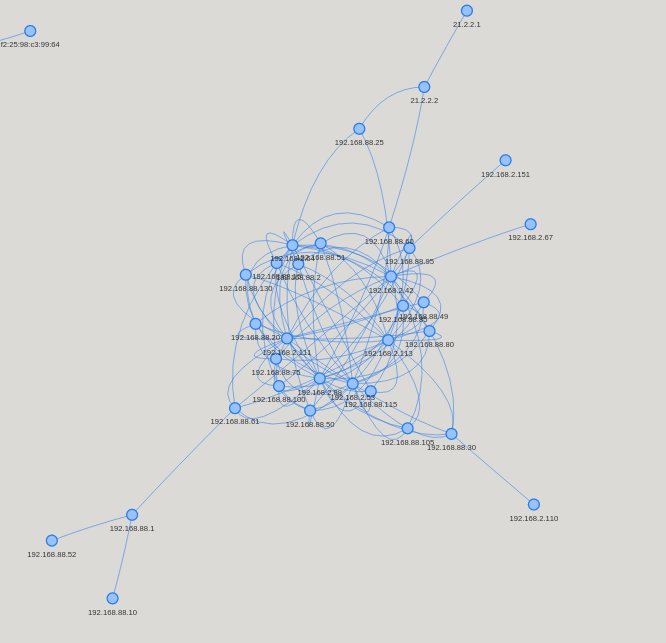

# net_analyze

quick summary of pcap dumps written in rust, with some help of python.

net_analyze will summarize pcap files, for that it grabs unique IPs, MACs,
and lower ports used in the supplied pcap file.

To further with with the data net_analyze creates:

- a csv
- a report as a text file
- a .dot file for graphviz
- a visualization as a png using networkx
- an interactive visualization using pyviz

net_analyze processes ~250000 packets in 3.2 seconds on my machine.

# Example

A report looks like this:

```
-- Unique IP Adresses
21.2.2.1        192.168.88.95   192.168.88.60   192.168.88.15   
10.0.1.1        192.168.2.67    192.168.89.1    192.168.88.49   
192.168.88.130  192.168.2.88    192.168.88.52   10.10.10.10     
192.168.88.20   21.2.2.2        192.168.2.151   10.10.10.20     
192.168.88.51   17.253.34.253   192.168.88.85   192.168.0.100   
192.168.57.2    192.168.57.10   192.168.88.10   192.168.88.100  
192.168.88.105  192.168.2.110   192.168.88.75   192.168.88.25   
192.168.88.61   192.168.0.2     192.168.2.42    0.0.0.0         
192.168.2.64    192.168.89.2    192.168.88.50   192.168.88.30   
192.168.2.53    192.168.88.1    192.195.142.13  192.168.88.80   
192.168.2.113   192.168.88.115  10.10.10.30     192.168.2.111   
192.168.88.2    192.168.57.3    8.8.8.8         192.168.1.10    


-- Unique MAC Adresses
00:05:e4:01:24:d3    00:e0:62:00:17:0a    00:0c:29:51:a9:47    b0:99:28:d9:1a:24    
00:d0:c9:a5:c9:2d    00:0a:dc:64:85:c3    00:11:22:7b:c5:50    00:71:00:ff:11:a2    
04:18:d6:83:db:16    00:1c:06:27:64:11    00:90:e8:26:7b:17    6c:70:9f:d2:2a:4e    
00:80:63:b5:b6:bb    68:f7:28:3f:67:5c    f0:7d:68:7a:4b:20    00:d0:c9:bd:2e:57    

-- SNIP --

```

The interactive graph is opened in a browser, looks like this:



The .dot/.csv file can by opened in programs such as `gephi`.

# Usage
```
cargo build --release
cd target/release/
./net_analyze [PATH-TO-PCAP]
```

# Dependencies 

Python3:
```
pip3 install pyvis networkx pandas matplotlib
```

